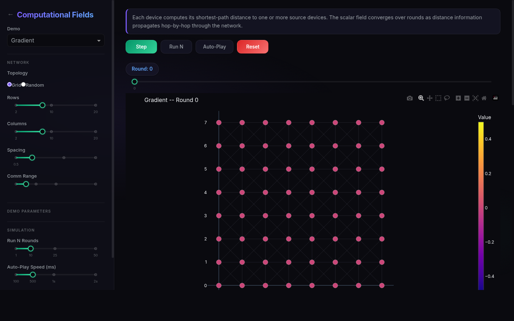

<p align="center">
  
  
  
  
</p>

<h1 align="center">Computational Fields Simulator</h1>

<p align="center">
  <strong>An interactive simulator for aggregate computing and self-organising programs</strong><br>
  Built as part of a Computer Science thesis at the <a href="https://www.unicam.it">University of Camerino</a>
</p>

<p align="center">
  <a href="https://huggingface.co/spaces/Sams995/computational-fields"></a>
</p>

<p align="center">
  <a href="https://samuele95.github.io/computational-fields/">Documentation</a> &bull;
  <a href="https://huggingface.co/spaces/Sams995/computational-fields">Live Demo</a> &bull;
  <a href="#demos">Demos</a> &bull;
  <a href="#quick-start">Quick Start</a> &bull;
  <a href="#architecture">Architecture</a>
</p>

---

## Overview

**Computational Fields** is a Python framework and interactive simulator that implements the core abstractions of [aggregate computing](https://doi.org/10.1109/MC.2015.261) -- a macro-programming paradigm where distributed systems are programmed as if they were a single machine operating on spatial data structures called *computational fields*.

A computational field is a function that maps every device in a network to a value at every point in time:

```
phi : D x T -> V
```

This project provides:

- A **field calculus runtime** implementing the five core constructs (`rep`, `nbr`, `share`, `branch`, `foldhood`)
- **Self-stabilising building blocks** (G, C, S, T) that compose into complex distributed behaviours
- An **interactive web simulator** with real-time visualisation of field evolution
- **Six ready-made demonstrations** covering gradient propagation, channel formation, leader election, crowd monitoring, wave propagation, and self-healing networks

## Screenshots

<p align="center">
  <br>
  <em>Welcome page with demo cards</em>
</p>

<p align="center">
  <br>
  <em>Interactive simulator with gradient field visualisation</em>
</p>

## Demos

| Demo | Building Blocks | Description |
|------|----------------|-------------|
| **Gradient** | G | Shortest-path distance field propagation from source devices |
| **Channel** | G + G + G | Logical corridor formation between source and destination regions |
| **Sparse Leaders** | S | Uniformly-spaced leader election using symmetry breaking |
| **Crowd Monitoring** | G + C + S + broadcast | Full case study: density estimation, alert zones, exit navigation |
| **Wave Propagation** | G + rep | Periodic pulse broadcasting from a time-varying source |
| **Self-Healing** | G | Network recovery after arbitrary device removal |

## Quick Start

### Prerequisites

- Python 3.10 or later
- pip or [uv](https://github.com/astral-sh/uv)

### Installation

```bash
git clone https://github.com/Samuele95/computational-fields.git
cd computational-fields
pip install -e .
```

### Run the Simulator

```bash
python app.py
```

Open [http://localhost:7860](http://localhost:7860) in your browser.

### Run the Examples

```bash
python -m computational_fields.examples.gradient_demo
python -m computational_fields.examples.channel_demo
python -m computational_fields.examples.crowd_monitoring
```

### Run the Tests

```bash
pip install -e ".[dev]"
pytest
```

## Architecture

The project follows a layered architecture, from low-level field calculus primitives up to high-level interactive visualisation:

```
+---------------------------------------------------------+
|                  Interactive Simulator                    |
|              (Dash UI with Plotly charts)                 |
+---------------------------------------------------------+
|                  Simulation Engine                        |
|          (synchronous round execution, history)          |
+---------------------------------------------------------+
|               Self-Stabilising Blocks                    |
|      G (gradient)   C (collect)   S (sparse)   T (time) |
+---------------------------------------------------------+
|                 Composite Patterns                        |
|       channel    partition    distributed_average         |
+---------------------------------------------------------+
|                  Field Calculus Core                      |
|       rep   nbr   share   branch   foldhood              |
+---------------------------------------------------------+
|                    Network Layer                          |
|        Device   Context   Network   Sensors              |
+---------------------------------------------------------+
```

### Project Structure

```
computational_fields/
  core/
    device.py          # Device model (state, sensors, exports)
    context.py         # Per-round execution context with call-path alignment
    primitives.py      # Five field calculus constructs + derived operators
  blocks/
    gradient.py        # G block: self-stabilising distance estimation
    collection.py      # C block: data aggregation along potential fields
    sparse.py          # S block: uniform leader election
    time_decay.py      # T block: timers and exponential decay
    composites.py      # channel, partition, distributed_average
  simulation/
    network.py         # Spatial network with grid/random factories
    engine.py          # Synchronous simulation loop
    sensors.py         # Sensor configuration factories
  visualization/
    dash_app.py        # Dash interactive application
    renderer.py        # Matplotlib static renderer
    interactive.py     # Streamlit alternative UI
  examples/
    gradient_demo.py   # Gradient propagation walkthrough
    channel_demo.py    # Channel formation demo
    crowd_monitoring.py # Full crowd safety case study
tests/
  test_primitives.py   # Unit tests for field calculus core
  test_blocks.py       # Integration tests for G, C, S, T blocks
  test_composites.py   # Tests for composite patterns
  test_network.py      # Network topology tests
  test_simulation.py   # Simulation engine tests
```

### Key Design Principles

- **Call-path alignment**: every primitive invocation is identified by its position in the abstract syntax tree, enabling compositional neighbour communication
- **Self-stabilisation**: all building blocks converge to correct outputs from arbitrary initial states within O(diameter) rounds
- **Synchronous execution**: all devices execute in lockstep each round, with exports collected atomically for deterministic behaviour
- **Type-generic primitives**: using Python generics, primitives work with any value type

## Theoretical Background

This implementation is grounded in the formal framework of **field calculus** as described in:

- Viroli, M., Beal, J., Damiani, F., Audrito, G., Casadei, R., & Pianini, D. (2019). *From distributed coordination to field calculus and aggregate computing*. Journal of Logical and Algebraic Methods in Programming, 109.
- Beal, J., Pianini, D., & Viroli, M. (2015). *Aggregate Programming for the Internet of Things*. IEEE Computer, 48(9).
- Audrito, G., Casadei, R., Damiani, F., Stolz, V., & Viroli, M. (2019). *Adaptive distributed monitors of spatial properties for self-organising systems*. Journal of Systems and Software, 149.

## Deployment

### Docker

```bash
docker build -t computational-fields .
docker run -p 7860:7860 computational-fields
```

### Hugging Face Spaces

The app is pre-configured for deployment on [Hugging Face Spaces](https://huggingface.co/spaces) using Docker SDK. Push the repository to a new Space and it will build automatically.

## License

This project is developed as part of a Computer Science thesis at the University of Camerino.

MIT License -- see [LICENSE](LICENSE) for details.

## Acknowledgements

- [University of Camerino](https://www.unicam.it) -- Computer Science Department
- The [aggregate computing](https://doi.org/10.1109/MC.2015.261) research community
- [Dash](https://dash.plotly.com/) and [Plotly](https://plotly.com/) for interactive visualisation
